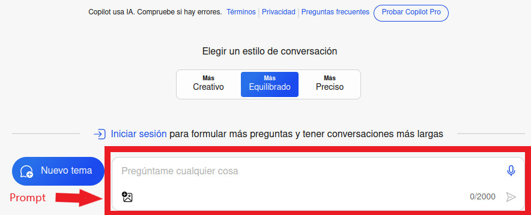
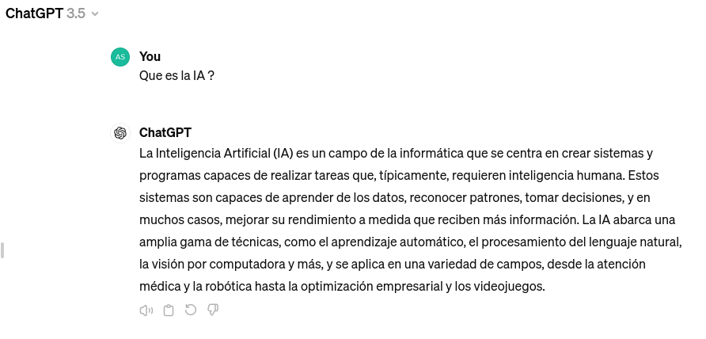
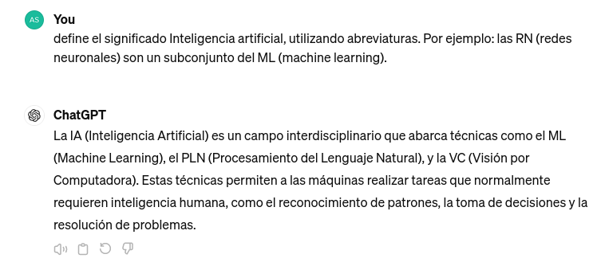
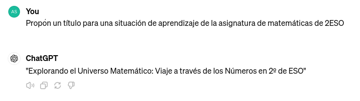
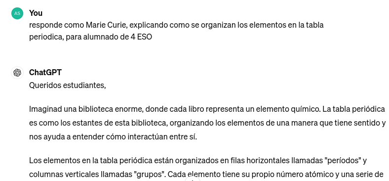
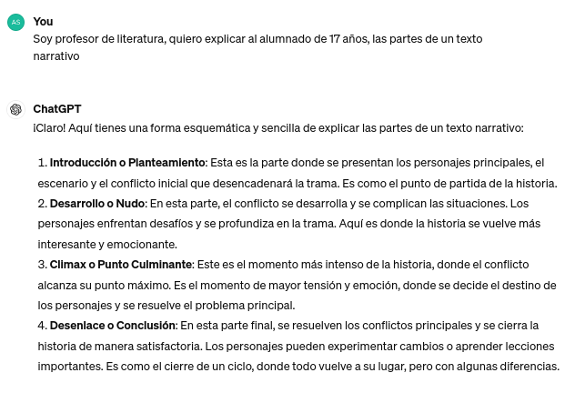

--- 
title: IA generativa conversacional
summary: La IA generativa conversacional transforma la interacción con la tecnología y ofrece nuevas posibilidades para la educación. Este documento presenta sus principales características, aplicaciones didácticas y recomendaciones para utilizarla de forma crítica, responsable y personalizada en el uso educativo.
authors:
    - Manuela Iborra
    - Jose Robledano
date: 2025-05-01
updated: 2026-09-30
---
# IA conversacional

La **IA conversacional** es una aplicación de la inteligencia artificial que permite interactuar mediante lenguaje natural. Los modelos actuales generan respuestas a partir de patrones aprendidos y del contexto disponible; no comprenden ni verifican la información como lo haría una persona. En educación debe utilizarse como apoyo para aprender, crear y revisar, no como autoridad ni como sustituto del profesorado.

Características de la IA conversacional:

- Entiende los patrones de comunicación humana y responde con un diálogo contextual.

- Incorpora algoritmos de IA y tecnología de procesamiento del lenguaje natural (PLN) para crear transiciones de diálogo fluidas.

- Genera conversaciones fluidas que pueden parecer humanas, aunque puede equivocarse, inventar fuentes o reproducir sesgos.

- Mantiene el contexto durante toda la conversación.

Esta tecnología ofrece una amplia gama de posibilidades para crear contenidos educativos innovadores y personalizados. Aquí se presentan algunas formas en que se puede utilizar la IA generativa para este fin:

## **Generación de Problemas y Ejercicios**

La IA generativa puede ser utilizada para generar una variedad de problemas y ejercicios en diversas áreas del conocimiento. Por ejemplo, en matemáticas, puede generar problemas de práctica con diferentes niveles de dificultad o incluso adaptarlos al progreso individual del estudiante. En ciencias, puede generar simulaciones interactivas que permitan a los estudiantes experimentar con fenómenos naturales de manera virtual.

## **Creación de Material Didáctico Personalizado**

Con la IA generativa, es posible crear material didáctico personalizado que se adapte a las necesidades y preferencias de aprendizaje de cada estudiante. Esto incluye la generación de textos, gráficos, videos y otros recursos multimedia que aborden los intereses individuales de los estudiantes y refuercen los conceptos clave de manera efectiva.

## **Desarrollo de Tutoriales Interactivos**

La IA generativa puede ser utilizada para desarrollar tutoriales interactivos que guíen a los estudiantes a través de conceptos complejos de manera dinámica y personalizada. Estos tutoriales pueden adaptarse según el progreso del estudiante, proporcionando retroalimentación instantánea y sugerencias de mejora.

!!! info "Son chats"

    Muchas IAs se presentan en forma de chat, lo que permite entablar un dialogo de aprendizaje sobre conceptos e ideas.

    Hay que plantear cuestiones adecuadas, y generar una dinámica de conversación orientada a las necesidades formativas concretas.


## **Creación de Contenido Creativo**

La IA generativa puede ser una herramienta poderosa para fomentar la creatividad en el aula. Por ejemplo, se pueden utilizar algoritmos generativos para crear obras de arte, composiciones musicales, historias o poemas originales. Esto no solo ayuda a los estudiantes a desarrollar su creatividad, sino que también les permite explorar diferentes formas de expresión artística.

## **Personalización del Material de Estudio**

Utilizando técnicas de IA generativa, es posible personalizar el material de estudio para adaptarlo a las necesidades individuales de cada estudiante. Esto incluye la generación de resúmenes, esquemas y ejemplos específicos que se ajusten al nivel de conocimiento y estilo de aprendizaje de cada estudiante.

!!! alert "Una poderosa herramienta"
    
    La IA generativa ofrece numerosas oportunidades para crear contenidos educativos dinámicos, interactivos y personalizados que pueden mejorar significativamente la experiencia de aprendizaje de los estudiantes. 
    
    Al integrar esta tecnología de manera efectiva en el aula, los educadores pueden potenciar el proceso de enseñanza y ayudar a los estudiantes a alcanzar su máximo potencial.


<figure markdown>{width=50%, height=50%}</figure>


## **Uso educativo responsable**

El objetivo no es incorporar IA por novedad, sino mejorar una experiencia de aprendizaje concreta. Antes de usarla conviene definir la competencia que se quiere trabajar, qué aporta la interacción con la herramienta y cómo se comprobará el aprendizaje sin ella.

- Utilizarla para plantear preguntas, ofrecer pistas, comparar soluciones, practicar idiomas, recibir retroalimentación sobre un borrador o adaptar ejemplos; evitar que haga por completo la tarea que debe aprender el estudiante.
- Pedir que explique el procedimiento y formule preguntas de comprobación, en lugar de aceptar una respuesta final sin razonamiento.
- Contrastar datos, citas, cálculos y código con fuentes fiables y con el conocimiento del docente. Una respuesta convincente puede ser falsa.
- Declarar cuándo y para qué se ha utilizado la IA, conservar las instrucciones relevantes y distinguir las aportaciones del estudiante de las generadas por la herramienta.
- No introducir datos personales, información sensible, trabajos identificables del alumnado ni materiales restringidos sin autorización. Revisar la privacidad, la edad mínima y las condiciones del servicio.
- Diseñar alternativas accesibles y sin IA para que su uso no sea una barrera económica o tecnológica.

### Evaluación y autoría

La IA generativa ha reabierto el debate sobre los deberes y la detección de textos generados. Los detectores no son pruebas concluyentes y pueden perjudicar especialmente a estudiantes que aprenden la lengua. Es preferible evaluar el proceso: borradores, diario de decisiones, defensa oral, resolución en clase, fuentes utilizadas y aplicación a situaciones nuevas. Las normas deben indicar qué usos están permitidos, cuáles requieren declaración y cuáles no son adecuados para la actividad.

La responsabilidad de la calificación corresponde al docente. La IA puede ayudar a preparar rúbricas o comentarios iniciales, pero toda retroalimentación debe revisarse para evitar errores, sesgos o expectativas injustas. No se deben tomar decisiones educativas relevantes exclusivamente a partir de una salida automática.

### Alfabetización crítica y ciudadanía digital

El alumnado debe aprender a reconocer respuestas inventadas, sesgos, dependencia del contexto e impacto ambiental; comparar respuestas, localizar evidencias, proteger su identidad digital y reflexionar sobre autoría, derechos de autor y accesibilidad. Estas capacidades forman parte de la competencia digital.

La regulación también está evolucionando. En la Unión Europea, el Reglamento de Inteligencia Artificial establece obligaciones graduadas por riesgo y exige especial cautela con determinados usos educativos, como la evaluación o la clasificación de estudiantes. La normativa aplicable y las políticas del centro deben comprobarse antes de implantar una herramienta.

## **Recomendaciones para el buen uso de la IA**

El **prompt** es el texto que se redacta para comunicar las instrucciones a la IA. Una elaboración adecuada ayuda a obtener resultados satisfactorios.

Algunos consejos básicos:

- Realizar preguntas claras y concisas.
- Usar palabras claves del tema.
- Desglosar preguntas complejas en preguntas más simples.
- Ser persistente si no se consigue una respuesta satisfactoria, es decir volver a reescribir la pregunta formulada de otra forma.
- Si vamos a cambiar el tema de la conversación, es mejor comenzar una conversación nueva.
- Validar la información obtenida **siempre**.


## **Herramientas conversacionales**

Existen muchas herramientas conversacionales y sus modelos, funciones, límites y condiciones cambian con rapidez. La elección debe responder a la finalidad didáctica, la edad del alumnado, la protección de datos, la accesibilidad, el coste y la posibilidad de supervisión.

Las siguientes descripciones son orientativas y no sustituyen la documentación actual de cada proveedor.

### ChatGPT
El acceso, los modelos disponibles y los límites dependen del país, la edad, el tipo de cuenta y los cambios del servicio. Suele existir un nivel gratuito con límites de uso y planes de pago, pero no debe darse por supuesto qué modelo se ofrece en cada nivel: el selector de modelos y la documentación oficial son la referencia. Los nombres **GPT-4o**, **o4-mini** y **GPT-4o-mini** corresponden a modelos o familias que pueden retirarse, sustituirse o quedar limitados; **GTP-4o-mini** era una errata.

Al iniciar sesión se puede consultar y continuar conversaciones anteriores, ya que quedan almacenadas en el historial. 

Se pueden utilizar diferentes idiomas sin que se aprecien diferencias importantes en las respuestas obtenidas.

Se pueden generar diferentes conversaciones al mismo tiempo y cada una sigue un hilo diferente. Si se alcanza el límite de conversaciones se genera un aviso para ir eliminando algunas de ellas.

Después de generar cada respuesta, esta puede ser valorada, reproducida en audio, o copiada. Si se solicita que la regenere, además solicitará que se haga una comparación entre los resultados ofrecidos.

Puede seleccionar automáticamente un modelo o modo de razonamiento según la tarea y el nivel de cuenta. También puede ofrecer análisis de archivos, imágenes, datos, voz, generación de imágenes, búsqueda web y asistentes personalizados, cuando esas funciones estén habilitadas. La disponibilidad y los límites cambian con frecuencia.

Incorpora la opción **búsqueda web**, que puede consultar información reciente y mostrar fuentes; aun así, las referencias deben comprobarse y no todas las respuestas requieren navegación.

Con **Explorar GPTs** se puede acceder a asistentes creados por otros usuarios y crear asistentes propios, si la cuenta dispone de esa función. Conviene revisar sus instrucciones, fuentes, permisos y política de privacidad antes de utilizarlos con alumnado.


!!! alert "Constante y frecuente actualización"

    Los servicios y características que ofrece pueden variar con bastante rapidez, debido a varias causas.

    Hay que estar atento a las novedades y posibilidades nuevas que se abren.

    También es posible que se incorporen nuevas características que no siempre han estado disponibles.


Algunas limitaciones:

- Las funciones de web, archivos, voz, imágenes, conectores y acciones no están disponibles en todas las cuentas ni en todos los entornos.
- Puede equivocarse, inventar referencias o interpretar mal archivos; no sustituye la verificación ni el criterio docente.
- El historial, el uso de datos para mejorar el servicio y los controles de administración dependen de la configuración y del tipo de cuenta.


### Copilot
Es la familia de asistentes de Microsoft, basada en modelos de distintos proveedores y no exclusivamente en ChatGPT. La experiencia y las prestaciones cambian entre **Copilot** para uso personal, **Microsoft 365 Copilot** para organizaciones y **GitHub Copilot** para programación; también dependen de la licencia, la cuenta y las políticas del administrador.

Tiene cierta integración con el buscador [**bing.com**](https://www.bing.com){:target="_blank"}, de manera que si se utiliza este último, se pueden formular preguntas directas y conseguir amplias respuestas sintetizadas a partir de los resultados de la búsqueda web. También aparecen las referencias de Internet a los sitios relacionados.

En algunas regiones se permite probar Copilot sin iniciar sesión, pero iniciar sesión puede habilitar más historial, límites y funciones. Puede proporcionar respuestas con citas mediante búsqueda web, analizar archivos o imágenes y generar imágenes cuando la cuenta y la región lo permitan.

!!! info "Integración con Microsoft 365"

    Microsoft 365 Copilot se integra, con una licencia adecuada, en aplicaciones como Word, Excel, PowerPoint, Outlook y Teams. No debe confundirse con el acceso gratuito a Copilot: cambian las funciones, la protección de datos y la administración.

#### Licencias educativas V1 y V3

En el contrato educativo, **V1** y **V3** identifican niveles de licencia de Microsoft 365 para educación; las prestaciones exactas dependen del contrato vigente y de lo que haya asignado el administrador. Habitualmente, V1 ofrece principalmente servicios y aplicaciones de Office en la Web, mientras que V3 añade aplicaciones de escritorio y prestaciones adicionales de administración y seguridad. Es necesario comprobar el catálogo institucional, pues las denominaciones comerciales y los derechos pueden cambiar.

En cuanto a **Copilot**, disponer de V3 en lugar de V1 no concede automáticamente Microsoft 365 Copilot. La integración de Copilot en Word, Excel, PowerPoint, Outlook o Teams requiere una licencia de Copilot elegible y su asignación por la organización, además de cumplir los requisitos aplicables. Algunas experiencias de Copilot Chat pueden estar disponibles de forma separada, pero su disponibilidad depende de la cuenta, la edad, la región y la configuración del administrador, y no equivale necesariamente a la integración con los datos de Microsoft 365. El centro debe confirmar las licencias y funciones habilitadas antes de planificar su uso educativo.


Los límites de mensajes, contexto, historial y archivos dependen del producto y del plan; al alcanzarlos puede ser necesario esperar, iniciar otro chat o cambiar de cuenta o licencia.

Las respuestas obtenidas también se pueden valorar, copiar y escuchar, además permite exportar directamente a un documento tipo *pdf*, *word* o *texto*.

Puede ofrecer estilos de conversación y modos de respuesta, pero sus nombres y opciones pueden cambiar.

Se pueden utilizar referencias a sitios web, y también es posible adjuntar imágenes, aunque para crear imagenes en la respuesta es necesario iniciar sesión.

Algunas cuentas incluyen funciones experimentales o de vista previa, como capacidades de voz, visión, investigación o generación de contenido. No deben considerarse estables ni garantizarse para una actividad educativa.

Su principal propósito es la integración en aplicaciones de escritorio para actuar como un *copiloto* en la actividad con las herramientas de software específico.


<figure markdown></figure>

### Gemini
IA generativa conversacional de Google, anteriormente llamada *Bard*. El acceso y los modelos —incluidas variantes rápidas y de razonamiento— dependen del país, la edad, la cuenta personal o Google Workspace y el plan. **Gemini Advanced** forma parte de determinadas suscripciones de Google y no debe describirse como una versión solo en inglés. En centros educativos debe utilizarse únicamente si el administrador lo ha habilitado y conforme a las políticas de Workspace for Education.

Las respuestas recibidas permiten realizar varias acciones, como son: valorar la respuesta, copiar, compartir creando un enlace un documento o un correo (en las herramientas de Google). Otra opción muy interesante es *modificar la respuesta* que permite definir si se quiere acortar, alargar o cambiar el tono a más informal o más profesional. 

Puede incluir funciones de comprobación mediante Google Search, enlaces a fuentes, análisis de archivos e imágenes, generación de imágenes, voz y conexión con aplicaciones de Google. Estas funciones, sus límites y la forma de mostrar las fuentes varían según el producto y la cuenta; una comprobación automática no demuestra que una respuesta sea verdadera.


!!! alert "En constante aprendizaje"

    En la propia información de la herramienta se insiste mucho en considerar la herramienta en una fase inicial, dentro de un proceso de aprendizaje continuo.

    Los resultados pueden parecer inconexos y con excesivas referencias a contenido de sitios web, lo que puede ser considerado como una mezcla de la tecnología de búsqueda con la IA generativa.

### Claude
Asistente conversacional de Anthropic. Ofrece un nivel gratuito con límites variables y planes de pago; en algunos países puede requerir registro y cumplir requisitos de edad. Los modelos y sus nombres cambian, por lo que conviene consultar la página oficial antes de afirmar cuál está incluido.

Capacidad para realizar conversaciones de texto completas.

Ayuda con redacción, resúmenes, ideas creativas y respuestas a preguntas.

Interfaz fácil de usar.

Disponible en varios idiomas, como puedes ver.

Se puede cambiar el formato de las respuestas, desde un desplegable en el espacio para escribir el prompt.


Algunas limitaciones:

- Número limitado de mensajes por día (comparado con suscripciones de pago).
- Los límites de mensajes, contexto, archivos y funciones avanzadas dependen del plan y de la demanda.
- Puede admitir análisis de documentos e imágenes, proyectos, artefactos o búsqueda, pero no necesariamente en todas las cuentas o regiones.
- Puede generar errores o citas inexactas; el razonamiento mostrado no garantiza la corrección del resultado.

### DeepSeek
Servicio y familia de modelos de DeepSeek, con acceso web y modelos que también pueden publicarse para uso local. Sus condiciones, modelos disponibles y límites dependen de la aplicación, la API, el país y el plan; deben consultarse antes de usarlo con datos educativos.

Tareas cotidianas: Ayuda en redacción, recomendaciones, explicaciones conceptuales o soporte para proyectos personales no comerciales.

Modelo estándar: Uso de una versión base del modelo, suficiente para necesidades generales.

Se pueden adjuntar imágenes y documentos textuales.


Algunas limitaciones:

- Límites de uso: Restricciones en el número de consultas por día/mes.

- La aplicación puede ofrecer conversación, carga de archivos, imágenes y modos de razonamiento, pero sus límites y disponibilidad pueden cambiar.
- La API y la aplicación tienen políticas de tratamiento, retención y transferencia de datos diferentes; no se deben introducir datos personales o confidenciales sin autorización.
- Los modelos pueden mostrar sesgos, respuestas incorrectas o restricciones de contenido. Para uso comercial, institucional o local hay que revisar la licencia concreta y las condiciones vigentes.


### Kimi
Kimi es una familia de modelos y un asistente de inteligencia artificial desarrollado por Moonshot AI. Sus funciones y modelos disponibles evolucionan con rapidez y pueden variar según la aplicación, la API, el país y el plan. Se puede utilizar para redactar y resumir, responder preguntas, analizar documentos y, según la versión, trabajar con imágenes, búsqueda web, programación y tareas de razonamiento. Algunas versiones admiten contextos extensos, útiles para consultar documentos largos; no todas las funciones están disponibles en todas las cuentas.

Sus puntos diferenciales pueden ser el manejo de contextos largos y la disponibilidad de modelos para integración mediante API, que facilita crear pruebas y automatizaciones. Esto no significa que sea superior a modelos más potentes o populares: el rendimiento depende de la tarea y de la versión, mientras que otros servicios pueden destacar por sus herramientas, integración, soporte o calidad en ámbitos concretos. Antes de usarlo, conviene consultar la información oficial sobre funciones, límites y precios vigentes.

Algunas limitaciones:

- Puede generar errores o referencias no verificables; hay que revisar sus respuestas.
- Antes de compartir documentos o usar la API, se deben comprobar las políticas de privacidad, las condiciones de uso y la licencia del modelo concreto.

## **El prompt de la IA**

El **prompt** es una instrucción, una pregunta o un texto que se utiliza para interactuar con un sistema de IA. Es el elemento esencial para que la IA empiece a funcionar. El prompt que introducimos influye en el tipo de respuesta que genera el modelo y, por tanto, afecta directamente a su utilidad y calidad.

Según el tipo de prompt, obtendremos un resultado más o menos ajustado a nuestras necesidades. Sin embargo, un prompt detallado no garantiza que la respuesta sea correcta: siempre hay que revisar y contrastar la información.

!!! info
    Dada la importancia de conseguir un prompt optimizado, ha surgido un perfil profesional llamado *Ingeniero de prompts* para desarrollar instrucciones precisas para generar buenos resultados para la empresa.

Es importante que los prompts incluyan el contexto necesario y que no contengan ambigüedades o dobles sentidos que puedan hacer que los algoritmos de una IA interpreten de forma errónea lo que le pedimos. También conviene indicar las restricciones, los criterios que debe cumplir la respuesta y qué debe hacer el sistema si no dispone de información suficiente.


### **Prompts efectivos**

Criterios para realizar un buen prompt:

- Preguntas claras y específicas.

- Utilizar palabras clave relacionadas con tu tema.

- Desglosar preguntas complejas en partes más simples.

- Comprobar la respuesta obtenida por si hay algo incorrecto.

- Cuando iniciamos una conversación con una IA, lo que ha dicho antes influye en las respuestas actuales, si se está cambiando de tema o no gusta cómo está respondiendo es mejor comenzar una conversación nueva.

- Experimentar. Si no se obtiene lo que se quiere, hay que probar a cambiar la forma de hacer las preguntas, los datos que le proporcionamos, el tono con el que le hablamos, el rol que le hemos proporcionado, etc.

Una plantilla útil es:

```text
Actúa como [rol]. Necesito [tarea] para [público o contexto].
Utiliza estos datos: [información]. Responde en [formato] y con un tono
[tono]. Incluye [criterios o elementos obligatorios] y no inventes datos;
si falta información, indícalo y formula las preguntas necesarias.
```

Para mejorar el resultado, se puede pedir a la IA que explique los supuestos que ha utilizado, que presente varias alternativas, que indique las limitaciones de su respuesta o que revise el resultado con una lista de criterios. No es recomendable solicitar una cadena de pensamiento privada; es suficiente con pedir una justificación breve, un resumen del procedimiento o las fuentes que deben verificarse.

Ejemplo de un prompt básico y correcto:


<figure markdown></figure>

Un prompt contextualizado:


<figure markdown></figure>

### **Elementos del prompt**

Una posible forma de generar un buen prompt puede ser la siguiente:

**[Tema o tarea] [Contexto] [Ejemplo] [Persona o rol] [Formato] [Tono] [Restricciones]**

!!! info "Un buen prompt"

    No es necesario incluir todos los elementos en todo prompt. Se puede ir aportando matices conforme se van recibiendo respuestas. 

- **Tarea o tema**: Descripción específica de qué se quiere obtener. Conviene utilizar un verbo de acción y evitar la multitarea. Puede ser crear preguntas sobre un tema específico, explicar un concepto, evaluar una actividad o proponer ejercicios.
- **Contexto**: Detalles adicionales que ayudan a definir la situación. Por ejemplo, detalles sobre un problema de un curso de 4 de primaria que están intentando resolver.
- **Ejemplo**: Modelo que sirve de referente.
- **Persona o rol**: Cómo tiene que actuar la inteligencia artificial. Por ejemplo, un profesor de física, un amigo dando consejos o un especialista en mecánica de buques.
- **Formato**: Organización de la respuesta. Por ejemplo, una tabla, una hoja de cálculo, un esquema de diapositivas, el código de un programa o Moodle XML.
- **Tono**: El sentido que tiene que dar a la conversación. Ayuda a definir el nivel de detalle y el lenguaje que debe utilizar en la respuesta. Por ejemplo, amigable, cariñoso, estricto, agresivo, divertido, etc.
- **Restricciones**: Condiciones que debe respetar, como la extensión, el nivel educativo, el idioma, el número de ejemplos, los contenidos que debe evitar o los criterios de evaluación.

### **Parámetros y opciones de configuración**

Además del prompt, algunas aplicaciones permiten modificar opciones que influyen en la respuesta. Su disponibilidad y nombre dependen de la herramienta y del modelo:

- **Modelo**: Los modelos pueden estar optimizados para conversación, razonamiento, código, imágenes o rapidez. Elegir el modelo adecuado suele tener más impacto que cambiar otros parámetros.
- **Temperatura o creatividad**: Un valor bajo produce respuestas más predecibles y consistentes; uno alto favorece la variedad y las ideas creativas, aunque puede aumentar los errores. No todas las interfaces permiten modificarla.
- **Límite de salida**: La longitud máxima de la respuesta, expresada a veces en tokens o palabras. Un límite bajo puede truncar el resultado.
- **Top-p y penalizaciones**: Algunas API permiten limitar las alternativas probables o reducir repeticiones. No conviene modificar estos controles a la vez que la temperatura, porque resulta difícil saber cuál ha causado el cambio.
- **Instrucciones personalizadas, memoria o mensaje de sistema**: Permiten indicar preferencias estables, como el idioma, el nivel de detalle o el perfil del usuario. No deben contener datos personales innecesarios ni sustituir las instrucciones de cada tarea.
- **Herramientas y fuentes**: Se puede activar la búsqueda web, la lectura de archivos, el análisis de imágenes o la ejecución de código. Hay que comprobar qué fuentes se han usado y qué permisos se conceden.
- **Formato de salida**: Algunas herramientas permiten solicitar o configurar JSON, tablas, Markdown u otros formatos. Aun así, es recomendable describir en el prompt la estructura esperada.

Como regla práctica, primero hay que definir bien la tarea y el contexto; después, ajustar el modelo, el formato y la longitud. La temperatura y otros parámetros avanzados deben probarse con ejemplos pequeños y compararse con criterios claros. Los parámetros no corrigen instrucciones ambiguas ni garantizan la veracidad del contenido.

!!! alert "Aviso sobre resultados"

    Recuerda que todas las herramientas avisan en sus condiciones de uso que no son responsables del uso de las respuestas, siendo al usuario quién debe considerar la validez de los contenidos obtenidos.


## **Ejemplos de prompts** 


**Ejemplo 1:** 

<figure markdown></figure>

**Ejemplo 2:**

<figure markdown></figure>

**Ejemplo 3:**

<figure markdown></figure>

!!!alert "Recuerda"

    Es mejor reiniciar una conversación nueva si quieres cambiar el tema, el rol, el contexto o el usuario final.
