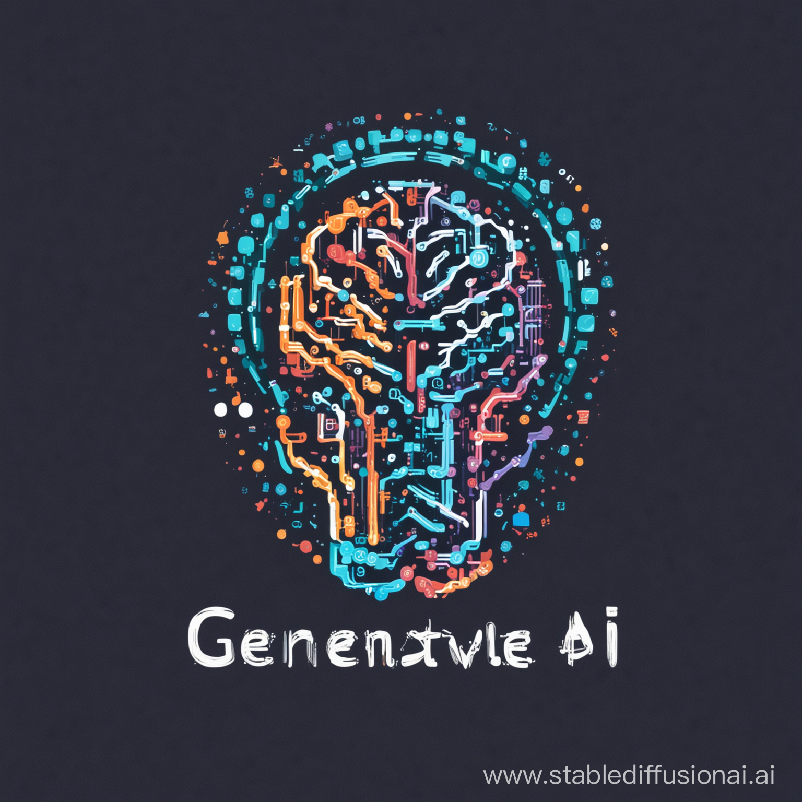
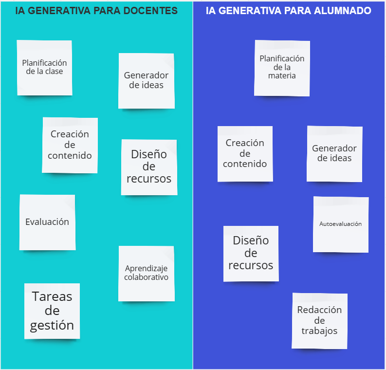
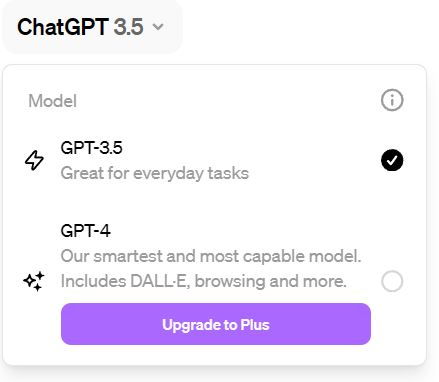
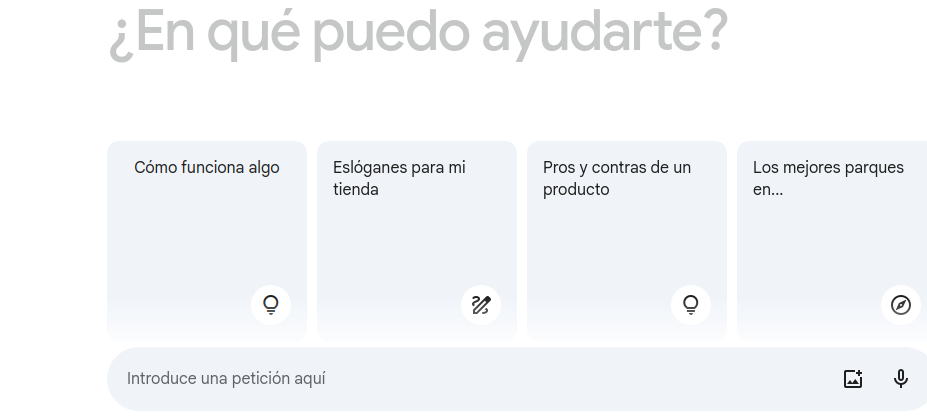

--- 
title: Fundamentos
summary: Presentación de la IA generativa. Aplicación y conceptos básicos.
authors:
    - Manuela Iborra
    - Jose Robledano
date: 2025-04-11
---
# **FUNDAMENTOS DE LA IA GENERATIVA**

## **¿Qué es la IA?**

La Inteligencia Artificial es uno de los mayores avances tecnológicos que hemos tenido en los últimos tiempos, de ahí la curiosidad por conocer herramientas de IA que nos ayuden en nuestro trabajo diario.

Se puede definir la IA como *la capacidad que tiene un dispositivo para realizar tareas que generalmente requieren inteligencia humana*, es decir, la capacidad de una máquina para pensar, aprender, razonar y tomar decisiones como lo haría una persona.

El matemático británico *Alan Turing (1912-1954)* es considerado uno de los padres de las Ciencias de la Computación. Entre muchas de sus contribuciones formuló la prueba que lleva su nombre **"El test de Turing"**. Según este investigador, una máquina capaz de pasar el test de Turing se podría considerar inteligente.

El test de Turing consiste en hacer que una persona hable a través de una pantalla y un teclado simultáneamente con un grupo de individuos entre los que se esconde un ordenador. A la vista de las respuestas que recibe de cada uno de ellos, esta persona debería ser capaz de saber quién es el ordenador y quiénes son los seres humanos. Si el ordenador no es descubierto, se podría considerar que ha pasado el test de Turing. Dado que la conversación se lleva a cabo en forma de texto, a través de un teclado y un monitor, no es necesario que la máquina sea capaz de transformar el texto en voz, aunque estoy hoy en día ya es posible. Esta prueba no evalúa conocimientos, dado que un ser humano no lo sabe todo, sino que lo que mide es la capacidad de una máquina de conversar como lo haría un ser humano.

Ya han pasado más de 70 años desde que se enunciara el test de Turing y hay máquinas que han conseguido superarla.

{width=50%, height=50%}

Arriba con cambios.

{width=50%, height=50%}

## **IA Generativa**

!!! info "Autodefinición"
    Como inteligencia artificial generativa, mi función principal es generar texto, imágenes, música y otros tipos de contenido basado en el aprendizaje de grandes cantidades de datos. Utilizo algoritmos de aprendizaje automático para comprender patrones y estructuras en esos datos, lo que me permite crear contenido nuevo y original que a menudo es difícil de distinguir de lo creado por humanos.

    Mi capacidad para generar contenido se basa en la diversidad y calidad de los datos con los que fui entrenado, así como en la arquitectura y algoritmos subyacentes que conforman mi funcionamiento. Sin embargo, aunque puedo producir contenido que parece humano, carezco de conciencia, emociones o intenciones propias. Mi propósito es ayudar y asistir a los usuarios en una variedad de tareas, desde la generación de ideas creativas hasta la asistencia en la resolución de problemas complejos.

    *ChatGPT 3.5*

## **Definición**

La inteligencia artificial generativa, es un tipo de software diseñado para crear contenido nuevo, como texto, imágenes o música, basándose en patrones aprendidos de grandes cantidades de datos. En otras palabras, puede ayudar a generar material creativo de manera automática utilizando lo que ha aprendido de ejemplos existentes. Por ejemplo, puede escribir historias, dibujar imágenes o componer música basándose en lo que ha visto y aprendido previamente. Sin embargo, es importante recordar que no tiene conciencia ni emociones como los seres humanos, y su función es ayudar y asistir en tareas específicas.

{width=300}

La inteligencia artificial generativa (IA generativa) se refiere a un conjunto de técnicas y algoritmos que permiten a las máquinas generar contenido original y creativo, como imágenes, texto, música y otros tipos de datos. A diferencia de los enfoques tradicionales de inteligencia artificial que se centran en tareas específicas y predictivas, la IA generativa se enfoca en la capacidad de crear nuevas instancias de datos que se asemejan a los ejemplos con los que ha sido entrenada.

La importancia de la IA generativa en la educación radica en varias áreas clave:

1. **Personalización del Aprendizaje**: La capacidad de generar contenido educativo personalizado y adaptado a las necesidades individuales de cada estudiante. Esto puede incluir la creación de materiales de estudio, ejercicios y evaluaciones diseñadas específicamente para cada alumno.

2. **Creatividad y Expresión**: La IA generativa puede fomentar la creatividad y la expresión artística en el aula, permitiendo a los estudiantes explorar y experimentar con la generación de arte, música, poesía y otros tipos de contenido creativo.

3. **Aprendizaje Experimental**: Mediante la generación de entornos virtuales y simulaciones interactivas, la IA generativa puede proporcionar experiencias de aprendizaje inmersivas y realistas que complementan la enseñanza tradicional.

4. **Automatización de Tareas Educativas**: La IA generativa puede ayudar a automatizar tareas administrativas y repetitivas, como la creación de exámenes y la corrección de ejercicios, liberando tiempo para que los educadores se centren en actividades más creativas y de alto valor agregado.

5. **Investigación Educativa**: La IA generativa puede ser una herramienta poderosa para la investigación educativa, permitiendo a los investigadores generar y analizar grandes volúmenes de datos de manera eficiente y descubrir patrones y tendencias que ayuden a mejorar la práctica pedagógica.

!!! alert "Llega la transformación"
    la IA generativa tiene el potencial de transformar la educación al proporcionar nuevas formas de crear contenido, personalizar el aprendizaje y mejorar la experiencia educativa tanto para estudiantes como para educadores. Sin embargo, es importante abordar de manera ética y reflexiva los desafíos y consideraciones asociadAs con su uso en el ámbito educativo.

## **Historia y evolución de la IA Generativa**

La historia y evolución de la inteligencia artificial generativa es fascinante y está marcada por avances significativos en diferentes áreas de la ciencia computacional y la investigación en inteligencia artificial. Aquí hay un resumen de los hitos importantes en esta evolución:

1. **Décadas de 1950 y 1960**: Los primeros intentos de crear sistemas generativos se remontan a los primeros días de la inteligencia artificial. En esta época, los investigadores exploraron modelos como las máquinas de estados finitos y los autómatas celulares para generar patrones y secuencias simples.

2. **Década de 1970**: Durante este período, se realizaron avances en el campo de la probabilidad y la estadística, lo que llevó al desarrollo de modelos generativos más sofisticados, como los modelos ocultos de Markov y los modelos de lenguaje estadísticos.

3. **Décadas de 1980 y 1990**: Con las redes neuronales artificiales y el aumento en la capacidad de computación, comenzaron a surgir enfoques más poderosos para la generación de contenido, como las redes neuronales recurrentes (RNN) y los modelos de mezcla gaussiana (GMM).

4. **Década de 2000**: Se produjeron avances significativos en el campo de la generación de imágenes y vídeo con la introducción de modelos generativos.

5. **Década de 2010**: Uno de los hitos más importantes fue la introducción de las Redes Generativas Adversarias (GANs) por Ian Goodfellow y sus colegas en 2014. Las GANs revolucionaron la generación de contenido al permitir que dos redes neuronales compitan entre sí, generando así resultados de alta calidad en una variedad de dominios, como imágenes, texto y música.

6. **Década de 2020 y más allá**: La investigación en inteligencia artificial generativa continúa avanzando a un ritmo acelerado, con aplicaciones cada vez más sofisticadas en campos como el arte, el diseño, la música, la escritura creativa y la simulación. Se espera que los avances futuros en áreas como el aprendizaje profundo y la computación cuántica impulsen aún más el desarrollo de técnicas generativas más potentes y versátiles.

!!! info "Innovación y avances constantes"
    La historia de la inteligencia artificial generativa es una historia de innovación constante y avances tecnológicos que han ampliado significativamente nuestras capacidades para generar contenido creativo y original en una variedad de dominios.

{width=50%, height=50%}

## **Fundamentos técnicos de la IA Generativa**

Las Redes Generativas Adversarias (GANs) son un tipo de arquitectura de red neuronal que consiste en dos redes neuronales enfrentadas entre sí: **el generador** y **el discriminador**. Aquí está un desglose más detallado:

1. **Principios de funcionamiento**: El generador toma una entrada aleatoria, comúnmente conocida como ruido latente, y la mapea a datos de salida, como imágenes o texto. Por otro lado, el discriminador es responsable de distinguir entre ejemplos reales y ejemplos generados por el generador. Ambas redes se entrenan de forma simultánea en un proceso competitivo: el generador intenta generar ejemplos cada vez más convincentes, mientras que el discriminador intenta mejorar su capacidad para distinguir entre ejemplos reales y falsos.

2. **Arquitectura básica**: La arquitectura básica de una GAN consiste en dos redes neuronales profundas conectadas en una configuración de adversario. El generador suele utilizar capas de redes neuronales convolucionales o completamente conectadas para generar datos, mientras que el discriminador puede seguir una arquitectura similar. Ambas redes están optimizadas utilizando técnicas de descenso de gradiente estocástico para mejorar la calidad de los ejemplos generados por el generador y la capacidad de discernimiento del discriminador.

3. **Aplicaciones en la generación de imágenes y texto**: Las GANs han demostrado ser altamente efectivas en la generación de contenido visual, como imágenes realistas de rostros humanos, paisajes y obras de arte. Además, también se han utilizado con éxito en la generación de texto, como la creación de descripciones de imágenes o la generación de texto coherente en diferentes estilos y tonos. Las GANs también se aplican en una amplia gama de otras áreas, como la síntesis de audio, la creación de videojuegos y la generación de música.

!!!info "Un aliado creativo"
    Las Redes Generativas Adversarias son una poderosa herramienta en el campo de la inteligencia artificial generativa, capaces de generar contenido visual y textual altamente realista y convincente. Su arquitectura básica y sus principios de funcionamiento las hacen extremadamente versátiles y adecuadas para una variedad de aplicaciones en la generación de contenido creativo.

## **Tipos de IA**

**IA débil:** son máquinas que solo pueden hacer tareas simples y específicas que se les ha programado. Por ejemplo, el reconocimiento de imágenes, Siri y Alexa, etc. 

**IA fuerte o inteligencia artificial general (AGI)** es el objetivo de crear máquinas que puedan igualar la inteligencia humana en cualquier tarea, pero aún no existe. En el contexto educativo, una IA fuerte podría adaptarse a diferentes estilos de aprendizaje, materias y niveles de habilidad, ofreciendo una enseñanza personalizada.

Un niño de tres años puede aprender cosas de una manera que los ordenadores de momento no pueden hacerlo. Un niño en realidad domina la física intuitivamente. Por ejemplo, sabe perfectamente que cuando tira una bola al aire, esta caerá, o cuando se derrama un líquido espera el desastre resultante. Sus padres no necesitan enseñarle las leyes de Newton o hablarles de las ecuaciones diferenciales que definen la trayectoria de los objetos. El niño descubre todas estas cosas sin supervisión.

## **IA Generativa en educación**

La inteligencia artificial generativa (IA generativa) está revolucionando la forma en que concebimos y abordamos el proceso de enseñanza y aprendizaje. La IA generativa puede ser aplicada de manera innovadora en el ámbito educativo, creando nuevas oportunidades para personalizar el aprendizaje, fomentar la creatividad y mejorar la experiencia educativa en su conjunto.

**Temas para reflexionar:**

1. **Creación de Recursos Educativos Generativos**: La IA generativa puede ser utilizada para crear recursos educativos personalizados y adaptados a las necesidades individuales de los estudiantes. Desde la generación de problemas matemáticos hasta la creación de simulaciones interactivas. Esta tecnología puede enriquecer el material de estudio y proporcionar experiencias de aprendizaje más efectivas y significativas.

2. **Personalización del Proceso de Enseñanza-Aprendizaje**: La IA generativa puede ser empleada para personalizar el proceso de enseñanza-aprendizaje, adaptando el contenido y la metodología de enseñanza a las preferencias y estilos de aprendizaje de cada estudiante. Los sistemas de tutoría inteligente y los asistentes virtuales pueden proporcionar retroalimentación individualizada y apoyo personalizado a los estudiantes.

3. **Integración de IA Generativa en Entornos de Aprendizaje Virtual**: La IA generativa puede ser integrada en plataformas de aprendizaje virtual, como aulas en línea y sistemas de gestión del aprendizaje (LMS), para enriquecer la experiencia de aprendizaje en línea. Desde la generación automática de contenido hasta la personalización del diseño de cursos. Esta tecnología puede mejorar la accesibilidad, la interactividad y la eficacia del aprendizaje en entornos virtuales.

Estas ideas nos invitan a imaginar un futuro en el que la IA generativa transforme radicalmente la forma en que enseñamos y aprendemos, proporcionando experiencias educativas más personalizadas, interactivas y significativas para todos los estudiantes. Al explorar las aplicaciones prácticas de esta tecnología en el ámbito educativo, podemos abrir nuevas fronteras para la innovación y el avance en la enseñanza y el aprendizaje.

## **IA Generativa para docentes**

La inteligencia artificial generativa (IA generativa) ofrece enormes posibilidades en el ámbito educativo, desde la personalización del aprendizaje hasta la creación de recursos educativos innovadores. Sin embargo, junto con estas oportunidades vienen importantes consideraciones éticas y responsabilidades que deben abordarse de manera integral.

Surgen cuestiones fundamentales sobre el uso responsable de esta tecnología y cómo garantizar que beneficie a todos los actores involucrados en el proceso educativo. Es necesario explorar las implicaciones éticas y sociales de la IA generativa en el contexto educativo.

**Ética en la Creación y Uso de Datos:** Cómo se recopilan, procesan y utilizan los datos en los sistemas de IA generativa. Cuestiones relacionadas con la privacidad, la transparencia y la equidad en el acceso a los datos, así como la importancia de garantizar la calidad y la representatividad de los conjuntos de datos utilizados en el entrenamiento de los modelos.

**Sesgo y Discriminación:** El sesgo en los algoritmos de IA generativa y cómo puede manifestarse en la generación de contenido educativo. Identificar, mitigar y evitar sesgos y discriminación en los sistemas de IA generativa.

**Impacto Social y Cultural:** El impacto en la educación, incluidas las implicaciones para la igualdad de oportunidades, la diversidad cultural y la autonomía del individuo. La tecnología puede influir en la percepción del conocimiento, el aprendizaje y la identidad en el entorno educativo.

Este tema nos invita a considerar no solo el potencial transformador de la IA generativa en la educación, sino también las responsabilidades éticas que conlleva su uso. Al abordar estas cuestiones de manera proactiva, podemos trabajar hacia un futuro en el que la IA generativa se utilice de manera ética y responsable para promover un aprendizaje inclusivo, equitativo y significativo para todos.

## **Herramientas**

### **ChatGPT**

**ChatGPT** es una aplicación conversacional basada en IA, desarrollada por la empresa OpenAI en 2022. Es capaz de generar respuestas humanas coherentes y contextuales a partir de un texto de entrada. Ha sido entrenado en una amplia gama de texto de internet y es capaz de participar en conversaciones en lenguaje natural, responder preguntas y completar solicitudes.

Existen actualmente varias versiones, que permiten el uso gratuito hasta cierto límite y otra de pago que tiene más prestaciones.

{width=300}

[Enlace a ChatGPT](https://chat.openai.com/){:target="_blank"}

### **Copilot**
Promovido por Microsoft, se anuncia como *"su complemento de IA para todos los días"*. Está integrado con el buscador [bing.com](https://www.bing.com){:target="_blank"}. Si estamos validados con un usuario de Microsoft, muestra una síntesis explicativa autogenerada a partir de la consulta realizada, al tiempo que aparecen los enlaces a sitios de Internet de la manera habitual.

**Copilot** dispone de otras herramientas derivadas que pueden utilizarse para generar imágenes, planes vacacionales, entrenador y asistente de cocina. También está integrado en otras aplicaciones de Microsoft.

[Enlace a Copilot](https://www.bing.com/chat?q=Microsoft+Copilot&FORM=hpcodx){:target="_blank"}

!!! info "Base de copilot"

    Copilot está basado en chatGPT y utiliza herramientas desarrolladas por la empresa **OpenAI**, donde Microsoft mantiene una participación importante.

!!! alert "Los agentes en copilot"

    Si se utiliza una cuenta para acceder. Existe la posibilidad de crear un **Agente** personal. 
    
    Este agente se puede crear utilizando un chat con IA, también a partir de una plantilla, o comenzar desde cero estableciendo tanto las instrucciones (prompt) como otras acciones vinculadas. 

### **Claude**

Es la nueva IA de Anthropic. Es una herramienta libre y de uso gratuito aunque también dispone de la versión de pago. La compañía destaca las mejoras significativas en lo referente a las capacidades de comprensión y resumen cuando se trabaja con documentos largos y complejos que requieren de un alto grado de precisión.

[Enlace a Claude](https://claude.ai/login?returnTo=%2F){:target="_blank"}

### **Gemini**

Imagina a Gemini como un superhéroe muy inteligente, creado por Google. Es como un libro mágico que sabe de todo, y puede entender y responder a lo que dices, escribes o dibujas.

**Superpoderes de comprensión:** Gemini puede entender diferentes idiomas, como si hablara muchos idiomas diferentes.

**Superpoderes de creatividad:** Puede inventar historias, escribir poemas, crear canciones o incluso ayudarte con tus tareas escolares.

**Superpoderes de conocimiento:** Sabe mucho sobre el mundo, como si fuera una enciclopedia gigante.

[Enlace a Gemini](https://gemini.google.com/app){:target="_blank"}

## **Recursos**

- Plataforma para programar de manera creativa [p5js](https://p5js.org/es/ "programación con javascript").
- Herramienta para procesado de efectos [processing.org](https://processing.org/examples "Utilidades para la creatividad")

